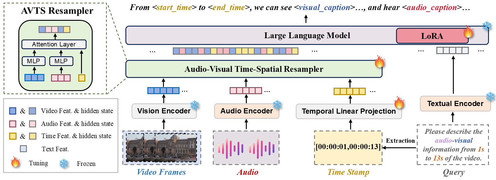
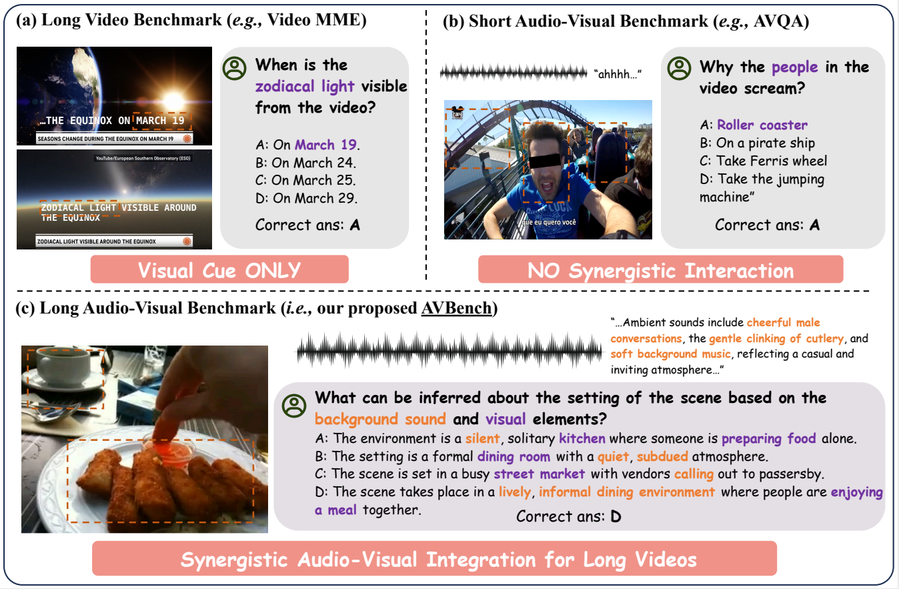
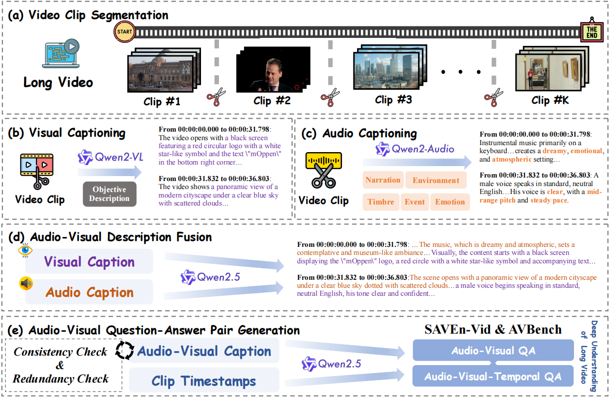

# **🌟 SAVEn-Vid: Synergistic Audio-Visual Integration for Enhanced Understanding in Long Video Context**

Welcome to the **SAVEn-Vid** repository! This project redefines long video comprehension by **seamlessly integrating audio-visual modalities**, delivering state-of-the-art performance on complex benchmarks like **AVBench**. You can find more details in our [Paper](https://arxiv.org/abs/2411.16213). We will release code and datasets soon~

## 🎯 **Highlights**

- **📊 Benchmark Innovation**: Introducing **AVBench**, a comprehensive evaluation suite for audio-visual reasoning in long video contexts.
- **🛠️ Data Pipeline**: Automated, scalable **data generation pipeline** for large-scale multi-modal datasets.
- **💡 Model Excellence**: **SAVEn-Vid**, an audio-visual large language model, achieves cutting-edge results through **temporal-spatial alignment and fusion**.


## 🏆 **Model Overview**

**SAVEn-Vid** leverages a novel **Audio-Visual Temporal-Spatial (AVTS) Resampler**, aligning features across time and space to enhance multi-modal understanding in complex, long video scenarios.

<p align="center">
  
</p>


## 🚀 **Features**

### 🔍 **AVBench Benchmark**

AVBench is our tailored benchmark for evaluating advanced **audio-visual reasoning** tasks in long video contexts. Explore our **illustrative comparison** with existing benchmarks below:

📄 [**AVBench vs. Existing Benchmarks**]
<p align="center">
  
</p>

### 📦 **Automated Data Pipeline**

Generate high-quality audio-visual datasets with our scalable **pipeline** designed for efficiency and robustness.

📄 [**Pipeline Overview**]

<p align="center">
</p>

### 🧠 **SAVEn-Vid Model**

Achieving state-of-the-art performance with its **temporal-spatial alignment**, **adaptive resampling**, and **multi-modal feature fusion**.


## 📈 **Performance**

SAVEn-Vid achieves **top-tier results** on AVBench and other benchmarks:

| Benchmark       | Metric      | SAVEn-Vid (7B) | Best Competitor |
|------------------|-------------|----------------|-----------------|
| **AVBench**     | Accuracy    | **66.7%**      | 77.29% (GPT-4)  |
| **VideoMME**    | Accuracy    | **56.21%**     | 54.92%          |
| **Music-AVQA**  | Accuracy    | **83.14%**     | 81.85%          |

## 📖 **Getting Started**

### 1️⃣ Clone the Repository

```bash
git clone https://github.com/username/SAVEn-Vid.git
cd SAVEn-Vid
### xxxxTBD
```

<p align="center"> ✨ If you find SAVEn-Vid useful, don’t forget to ⭐ the repo! ✨ </p>

## Citation

    @misc{li2024savenvid,
      title={SAVEn-Vid: Synergistic Audio-Visual Integration for Enhanced Understanding in Long Video Context}, 
      author={Jungang Li and Sicheng Tao and Yibo Yan and Xiaojie Gu and Haodong Xu and Xu Zheng and Yuanhuiyi Lyu and Linfeng Zhang and Xuming Hu},
      year={2024},
      eprint={2411.16213},
      archivePrefix={arXiv},
      primaryClass={cs.CV},
      url={https://arxiv.org/abs/2411.16213}, 
    }
